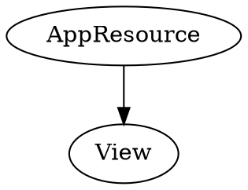
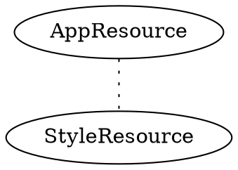
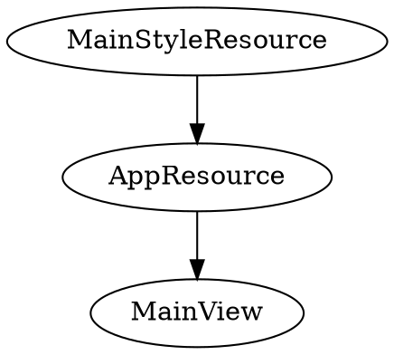

---
presentation:
  # === 可选的主题 ===
  # "beige.css"
  # "black.css"
  # "blood.css"
  # "league.css"
  # "moon.css"
  # "night.css"
  # "serif.css"
  # "simple.css"
  # "sky.css"
  # "solarized.css"
  # "white.css"
  # "none.css"  
  theme: serif.css

  # Display controls in the bottom right corner
  controls: true

  # Display a presentation progress bar
  progress: true

  # Display the page number of the current slide
  slideNumber: true

  # Push each slide change to the browser history
  history: false

  # Enable keyboard shortcuts for navigation
  keyboard: true

  # Enable the slide overview mode
  overview: true

  # Vertical centering of slides
  center: true

  # Enable slide navigation via mouse wheel
  mouseWheel: true

  # Hides the address bar on mobile devices
  hideAddressBar: false

  # Opens links in an iframe preview overlay
  previewLinks: false

  # Transition style
  transition: 'zoom' # none/fade/slide/convex/concave/zoom

  # Transition speed
  transitionSpeed: 'default' # default/fast/slow

  # Transition style for full page slide backgrounds
  backgroundTransition: 'zoom' # none/fade/slide/convex/concave/zoom
---

<!-- slide -->
## 数据库工具开发总结
<small>石晴蔚</small>

<!-- slide -->
### 一、项目概况

<!-- slide -->
### 项目需求
> **实现轻量的数据库交互工具，能够进行常用的数据操作,并在开发过程中锻炼实际开发能力**

<!-- slide vertical=true-->
 - 功能需求：
   - :ballot_box_with_check:直接连接本地的SqlServer
   - :ballot_box_with_check:获取本地SqlServer中的数据库列表，并屏蔽系统数据库
   - :ballot_box_with_check:备份数据库
   - :ballot_box_with_check:从备份文件恢复数据库
   - :ballot_box_with_check:查看数据表中的数据
   - :ballot_box_with_check:对数据表中的数据进行增/删/改
   - :ballot_box_with_check:完善的日志记录

<!-- slide -->
### 二、开发过程遇到的问题

<!-- slide -->
### 1.全屏溢出问题
问题描述：当需要自定义标题栏时，设置Window的两个属性可以屏蔽Wpf应用自带的标题栏
```xml
WindowStyle="None"
AllowsTransparency="True"
```
在应用全屏的时候就会出现溢出窗口的情况。

<!-- slide vertical=true-->
### 问题复现
新建一个空白wpf应用，将Window的两个属性设置好，即可复现
@import "Resources/Images/OverScreen.png" {title="OverScreen"}

<!-- slide vertical=true-->
### 根据Stackoverflow上的[问题](https://stackoverflow.com/questions/2092782/borderless-window-application-takes-up-more-space-than-my-screen-resolution)
原因是，即使屏蔽了默认的标题栏和边框，但是应用全屏时会占据原来默认边框的位置，导致溢出屏幕。

<!-- slide vertical=true-->
- 解决方案：
  -可以使用DataTrigger解决
```XML
<Style.Triggers>
            <DataTrigger 
                Binding="{Binding RelativeSource={RelativeSource Self},Path=WindowState}" 
                Value="{x:Static WindowState.Maximized}">
                <Setter Property="BorderThickness" Value="8"/>
            </DataTrigger>
        </Style.Triggers>
```

<!-- slide -->
### 2.资源定位问题
问题描述：应用于View的Style资源文件中无法使用在App.xaml中定义的全局资源

<!-- slide vertical=true-->

View.xaml可以直接调用App.Xaml中定义的全局资源

<!-- slide vertical=true-->

Style.xaml中无法定位App.xaml中定义的全局资源

<!-- slide vertical=true-->

- 解决方案：
  - 将资源在StyleResource中声明，然后在AppResource中注册为全局资源，再在View中使用。

<!-- slide -->
### 三、项目中的收获

<!-- slide -->
### 1.项目架构方面

<!-- slide vertical=true-->
#### 从这次的开发中，我深刻地感觉到架构对一个应用的重要性
**只要架构好，Review返工少**

<!-- slide vertical=true-->
起初，我对MVVM的理解很肤浅，仅仅是：
- Model层定义数据类
- View层页面展示
- ViewModel层进行所有的逻辑处理

<!-- slide vertical=true-->

#### 所以我的第一版项目代码是这样的：
- MainViewModel.cs [1000+ 行] [包含所有的逻辑处理]
- MainWindow.xaml [400+ 行] [样式还未达到设计要求]
- Model类里面只有数据定义，寥寥数行

<!-- slide vertical=true-->
#### 经过重构之后，我的项目文件终于清晰有序
- Model层：
  - 数据类定义
  - 能够处理某一类数据的方法
  - 与数据库相关的方法
- View层：
  - 仅包含必要的布局以及控件
  - 布局与控件的属性都写入Resources中的style资源文件中引用
- ViewModel层：
  - 对外暴露的Command
  - View层使用的Binding数据
  - Binding数据的封装

<!-- slide vertical=true-->
- Resources文件夹：项目中使用到的资源文件，例如Images,xaml样式等
- Converter文件夹：项目中用到的一些converter类

<!-- slide -->
### 总结
在实际开发之前，先结合实际开发需求，尽量先多做一些整体的规划设计，例如：
- 结合需求对数据类进行**概要设计**
- 细化功能点，对各功能点所需的方法进行**概要设计**
- 将概要设计得出的方法合理分入Model层或ViewModel层

<!-- slide -->
### 2.编码方面

<!-- slide vertical=true-->
#### 最重要的就是提高代码可读性
执行起来需要做到：
- 1. 代码文件结构清晰
     - Private属性-->Public属性-->Public方法--> Private方法
- 2. 命名正确完整无缩写，符合命名规范与编码规范
- 3. 做好参数校验

<!-- slide vertical=true-->
### 命名与编码规范
1. 用Pascal规则来命名常量、只读变量、属性、方法、事件和类名
2. 用Camel规则来命名成员变量、局部变量和方法的参数
3. 接口的名称一般以大写I作前缀
4. 类的命名：用名词或名词短语
5. 方法的命名：一般将其命名为动宾短语
6. 局部变量的名称要有意义
7. 代码合理分块

<!-- slide vertical=true-->
8. 布尔型变量或者方法一般可以用is、can、has或者should做前缀。如，isFinished, canWork等
9. 判断条件是一个布尔变量时不要使用==进行条件判断
10. 慎用缩写:变量名是一个单词的尽量不要缩写，多单词组成的变量名可适当缩写。
11. 在类的顶部声明所有的成员变量，静态变量声明在最前面
12. 如果一个方法超过30行，就需要考虑是否可以重构和拆分成多个方法。

<!-- slide -->
### 3.版本控制方面

<!-- slide vertical=true-->
- 每解决一个问题就需要提交一次，无论是解决了一个bug还是新增了一个功能
- 在commit信息中简略并准确地描述本次提交的信息
- 保持提交历史树的可追溯性

<!-- slide -->
### 4.Bug发现与调试
- 完成或修改功能后，及时测试该功能点
- 修改方法后，检查相关方法是否异常
- 检查完成后及时提交代码

<!-- slide -->
### 5.项目复盘，提高性能
1. 少用`try-catch`
2. 合理使用`DynamicSource`
3. 删除无用代码
4. 检查非托管资源是否及时释放
5. 合理使用语法糖提高性能，同时提高整洁性
6. 检查对外暴露的`Public`函数的安全性


